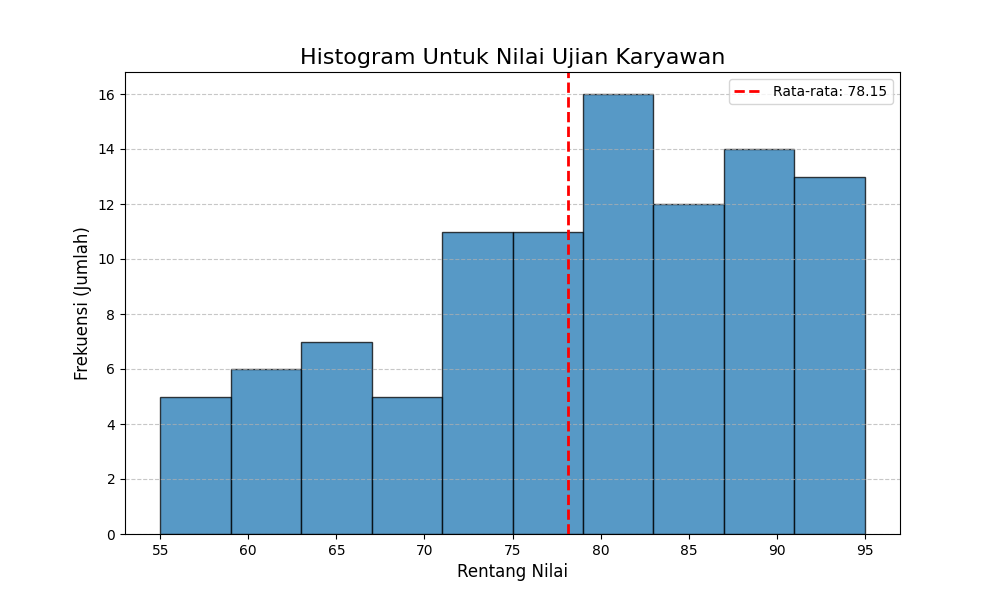

# Tugas Technical Test: Histogram Nilai Karyawan

Ini adalah solusi untuk tugas technical test membuat histogram menggunakan Python.

## Deskripsi

Skrip `HistogramPython.py` akan:
1.  Menggunakan 100 data nilai ujian statis (dummy data).
2.  Membuat visualisasi histogram dari data tersebut menggunakan `matplotlib`.
3.  Menghitung dan menampilkan garis nilai rata-rata (mean) menggunakan `numpy`.
4.  Menyimpan hasilnya secara otomatis dalam png

## Hasil Akhir



## Cara Menjalankan

1.  Pastikan Anda memiliki Python, `matplotlib`, dan `numpy`.
    ```bash
    pip install matplotlib numpy
    ```
2.  Jalankan skrip:
    ```bash
    python HistogramPython.py
    ```